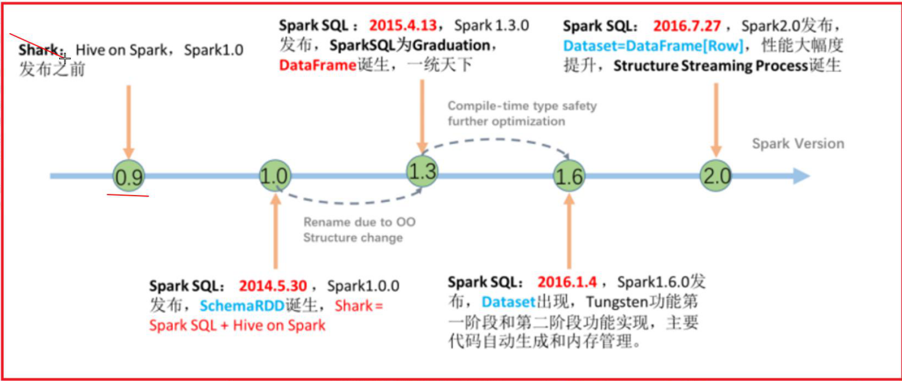
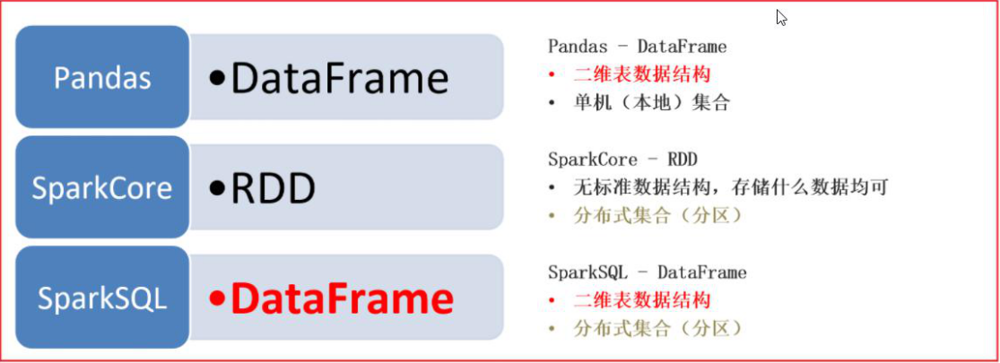
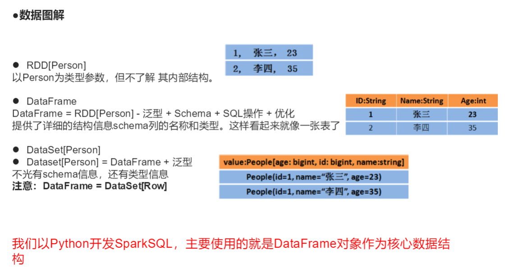

# Spark SQL基本概念

## 了解什么是Spark SQL

Spark SQL是Spark的一个模块，此模块主要用于处理结构化的数据

```properties
什么是结构化数据？
	一份数据，每行都有固定的长度，每列的数据类型都一致

```

​	Spark SQL主要是处理结构化的数据，而Spark Core可以处理任意数据类型

​	Spark SQL中核心数据结构为dataFrame:数据RDD+元数据schema


为什么学习Spark SQL

```properties
1-SQL比较简单，会SQL的人一定比会大数据的人多：SQL更加通用
2-Spark SQL可以兼容HIVE，可以让Spark SQL和hive集成，从而将执行引擎替换为Spark
3-Spark SQL不仅仅可以写SQL，还可以写代码，SQL和代码可以共存。
4-Spark SQL可以处理大规模的数据，底层是基于Spark RDD
```


Spark SQL的特点

```properties
1-融合性:Spark SQL中既可以编写SQL，也可以编写代码，也可以混合使用
2-统一的数据访问:使用Spark SQL可以和各种数据源进行集成，比如HIVE,MYSQL,Oracle...集成后，可以使用一套Spark SQL的API来操作不同的数据源的数据
3-HIVE兼容:Spark SQL可以和hive进行集成，集成后将HIVE执行引擎从MR替换为Spark，提升效率集成核心是共享matastore
4-标准化的连接:Spark SQL 支持JDBC/ODBC的连接方式，可以让各种连接数据库的工具来连接使用
```

## Spark SQL的发展历程



​	从2.0版本后，Spark SQL将Spark两个核心对象：dataSet和dataFrame合二为一了，统一称为dataSet，但是为了能够支持像Python这样没有泛型的语言，在客户端保留了dataFrame，当dataFrame、到达Spark后，依然会被转换为dataSet

## Spark SQL与hive异同

相同点：

```properties
1-Spark SQL和 HIVE 	都是分布式SQL引擎
2-都可以处理大规模的数据
3-都是处理结构化的数据
4-Spark SQL和HIVE SQL最终都可以提交到YARN平台来使用
```

区别：

```properties
1-Spark SQL是基于内存的计算，HIVE是基于磁盘的迭代计算
2-HIVE 仅能使用SQL来处理数据，而Spark SQL不仅可以使用SQL，还可以使用DSL代码
3-HIVE提供了专门用于元数据管理的服务:Metastore	而Spark SQL没有元数据管理的服务
4-HIVE底层是基于MR来运行的，而Spark SQL底层是基于RDD

```

## Spark SQL的数据结构对比



```properties
pandas的dataFrame:表示的是一个二维的表，仅能处理结构化的数据，单机处理操作，仅适合于处理小数据集分析

Spark Core的RDD:不局限于数据结构，分布式的处理引擎，可以处理大规模的数据

Spark SQL的dataFrame:表示的一个二维的表，仅能处理结构化的数据，可以分布式的处理，可以处理大规模的数据

在实际中：
	一般如果遇到的数据集以 kb MB 或者几个GB，此时可以使用pandas即可完成统计分析处理，比如财务的相关数据分析
	如果数据集以几十GB或者更大，必须使用大规模处理数据的引擎
```


```properties
RDD表示的具体数据对象，一个RDD就代表一个数据集

dataFrame:是将RDD中对象中各个属性拆解出来，形成一列列的数据，变更为一个二维的表

dataset：是在dataFrame的基础上，加入了泛型的支持，将每一行的数据，使用一个泛型来表示

从Spark SQL 2.0开始，整个Spark SQL只有一种数据结构:dataset
	但是由于Spark SQL需要支持多种语言的开发工作，有一些语言又不支持泛型。所以Spark SQL为了能够让这些语言对接Spark SQL，所以在客户端依然保留了dataFrame的接口，让其它无泛型的语言使用dataFrame接口来对接，底层会将其转换为dataSet
```

