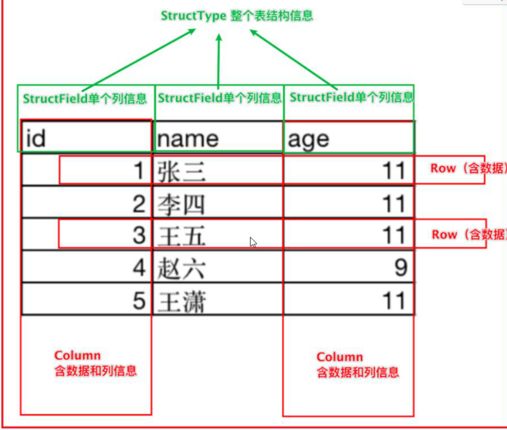

# DataFrame详解

## dataFrame基本介绍

dataFrame表示的是一个二维的表，既然是一个表，那么应该有字段名字，字段类型，数据

```properties
dataFrame中，主要有structType和structField和ROW组成的
其中：
	元数据相关对象：
		structType:其实dataFrame中表示schema元数据的核心对象
		structField:表示字段的对象，一个structType中可以有多个structField，类似于一个表中可以有多个列；覆盖三个部分的内容：字段名称，字段的类型，字段数据是否可以为空
	表数据相关对象
		ROW:行，表示行的数据，每一个行的数据就是一个ROW对象
		column:一列数据，包含列信息和列数据
```

- 

- 如何构建一个schema元数据信息


## dataFrame的构建方式

### 方式一: 通过RDD转换为dataFrame对象

```properties
from pyspark import SparkContext, SparkConf
from pyspark.sql import SparkSession
from pyspark.sql.types import *
import os

# 锁定远端python版本:
os.environ['SPARK_HOME'] = '/export/server/spark'
os.environ['PYSPARK_PYTHON'] = '/root/anaconda3/bin/python3'
os.environ['PYSPARK_DRIVER_PYTHON'] = '/root/anaconda3/bin/python3'

if __name__ == '__main__':
    print("方式一: 通过RDD转换为dataFrame")
    
     # 1- 创建SparkSession对象
    # 快速返回变量: ctrl + alt + v
    spark = SparkSession.builder.master('local[*]').appName("create_df").getOrCreate()
	
	# 从Spark中获取SparkContext对象
    sc = spark.sparkContext
    
    # 2- 读取数据, 获取RDD
    rdd_init = sc.parallelize([('c01','张三',20),('c02','李四',15),('c03','王五',26),('c01','赵六',30)])
    
    # 3- 通过RDD 将c01的数据过滤
    rdd_filter = rdd_init.filter(lambda tup:tup[0] != 'c01')
    
    # 4- 请将RDD转换dataFrame对象
    # 4.1 方案一
    # 一定一定一定要加 () 千万不要丢
    schema = StructType()\
        .add('id',StringType(),True)\
        .add('name',StringType(),False)\
        .add('age',IntegerType())
    df_init = spark.createDataFrame(rdd_filter,schema=schema)
    # 打印结果:
    df_init.printSchema()
    df_init.show()
    
     # 4.2 方案二:
    df_init = spark.createDataFrame(rdd_filter, schema=['id','name','age'])
    # 打印结果:
    df_init.printSchema()
    df_init.show()
    
    # 4.2 方案三:
    df_init = spark.createDataFrame(rdd_filter)
    # 打印结果:
    df_init.printSchema()
    df_init.show()
    
     # 4.3 方案四:
    df_init = rdd_filter.toDF()
    # 打印结果:
    df_init.printSchema()
    df_init.show()
    
     # 4.3 方案五:
    df_init = rdd_filter.toDF(schema=schema)
    # 打印结果:
    df_init.printSchema()
    df_init.show()
    
    # 4.3 方案六:
    df_init = rdd_filter.toDF(schema=['id','name','age'])
    # 打印结果:
    df_init.printSchema()
    df_init.show()


 	schema = StructType()\
        .add('id',StringType(),True)\
        .add('name',StringType(),False)\
        .add('age',IntegerType())
    df_init = spark.createDataFrame(rdd_filter,schema=schema)
	df_init = spark.createDataFrame(rdd_filter, schema=['id','name','age'])
	df_init = spark.createDataFrame(rdd_filter)
	
	df_init = rdd_filter.toDF()
	df_init = rdd_filter.toDF(schema=schema)
	df_init = rdd_filter.toDF(schema=['id','name','age'])
```

使用场景：

```properties
	当我们需要读取的数据是一种半结构化的数据，但是希望使用spark sql来处理。
	此时可以先使用spark core来读取数据，将数据进行清洗转换处理的操作，将其转换为结构化的数据。
	然后将RDD转换为DF，通过spark sql来处理
```

### 方式二：通过pandas的DF对象 转换为 spark SQL的DF对象

```properties
from pyspark import SparkContext, SparkConf
from pyspark.sql import SparkSession
import os
import pandas as pd

# 锁定远端python版本:
os.environ['SPARK_HOME'] = '/export/server/spark'
os.environ['PYSPARK_PYTHON'] = '/root/anaconda3/bin/python3'
os.environ['PYSPARK_DRIVER_PYTHON'] = '/root/anaconda3/bin/python3'

if __name__ == '__main__':
    print("演示pandas DF 转换为 spark SQL DF")
    
    # 1- 构建Spark SQL对象
    spark = SparkSession.builder.master('local[*]').appName("create_df").getOrCreate()
    
     # 2- 构建 pandas DF对象
    pd_df = pd.DataFrame({'id':['c01','c02','c03'],'name':['张三','李四','王五']})
    
    # 将pd_df 转换为 spark SQL的df
    spark_df = spark.createDataFrame(pd_df)

    spark_df.show()
    spark_df.printSchema()
```

```properties
当处理的数据源比较特殊的时候，比如excel格式，此时可以通过pandas的DF直接读取，然后转换为spark的DF进行处理，从而扩充spark的读取的数据源
```

### 方式三：通过读取外部文件的方式

```properties
通过完整的格式：
	sparkSession对象.read.format('text|csv|json|parquet|orc|avro|jdbc...)
		.option('参数的key','参数的值')#可选项：读取的格式不同，参数也不同
		.load('')
```

演示：读取csv

```properties
from pyspark import SparkContext, SparkConf
from pyspark.sql import SparkSession
import os

# 锁定远端python版本:
os.environ['SPARK_HOME'] = '/export/server/spark'
os.environ['PYSPARK_PYTHON'] = '/root/anaconda3/bin/python3'
os.environ['PYSPARK_DRIVER_PYTHON'] = '/root/anaconda3/bin/python3'

if __name__ == '__main__':
    print("读取外部文件的方式构建DF")
	
	# 1- 构建Spark SQL对象
    spark = SparkSession.builder.master('local[*]').appName("create_df").getOrCreate()
    
    # 2- 读取数据
    # sep参数: 设置csv文件中字段的分隔符号,默认为 逗号
    # header参数: 设置csv是否含有头信息  True 有  默认为 false
    # inferSchema参数: 用于让程序自动推断字段的类型  默认为false  默认所有的类型都是string
    # encoding参数: 设置对应文件的字符集 默认为 UTF-8
    df_init = spark.read\
        .format('csv')\
        .option('sep',',') \
        .option('header', True) \
        .option('inferSchema', True) \
        .option('	encoding', 'UTF-8') \
        .load('file:///export/data/workspace/sz30_pyspark_parent/_03_pyspark_sql/data/stu.csv')

	df_init.printSchema()
    df_init.show()
```


演示: 采用text方式读取数据

```python
from pyspark import SparkContext, SparkConf
from pyspark.sql import SparkSession
import os

# 锁定远端python版本:
os.environ['SPARK_HOME'] = '/export/server/spark'
os.environ['PYSPARK_PYTHON'] = '/root/anaconda3/bin/python3'
os.environ['PYSPARK_DRIVER_PYTHON'] = '/root/anaconda3/bin/python3'

if __name__ == '__main__':
    print("读取外部文件的方式构建DF")
    
    # 1- 构建Spark SQL对象
    spark = SparkSession.builder.master('local[*]').appName("create_df").getOrCreate()
    
    # 2- 读取数据
    # 采用text的方式来读取数据, 仅支持产生一列数据, 默认列名为 value, 当然可以通过schema修改列名
    df_init = spark.read\
        .format('text')\
        .schema(schema='id String')\
        
            .load('file:///export/data/workspace/sz30_pyspark_parent/_03_pyspark_sql/data/stu.csv')

    df_init.printSchema()
    df_init.show()
```

演示：采用JSON方式来读取数据

```properties
from pyspark import SparkContext, SparkConf
from pyspark.sql import SparkSession
import os

# 锁定远端python版本:
os.environ['SPARK_HOME'] = '/export/server/spark'
os.environ['PYSPARK_PYTHON'] = '/root/anaconda3/bin/python3'
os.environ['PYSPARK_DRIVER_PYTHON'] = '/root/anaconda3/bin/python3'

if __name__ == '__main__':
    print("读取外部文件的方式构建DF")

    # 1- 构建Spark SQL对象
    spark = SparkSession.builder.master('local[*]').appName("create_df").getOrCreate()

    # 2- 读取数据
    # 采用text的方式来读取数据, 仅支持产生一列数据, 默认列名为 value, 当然可以通过schema修改列名
    df_init = spark.read\
        .format('json')\
        .load('file:///export/data/workspace/sz30_pyspark_parent/_03_pyspark_sql/data/people.json')

    df_init.printSchema()
    df_init.show()
```

以上的语句都可以采用简写方式实现

```python
比如说以CSV举例说明:
	spark.read.csv(path ='xxx',header=True,encoding='UTF-8',inferSchema=True)

其他的类似: 
	spark.read.text
	           json
	           parquet
	           orc
	           jdbc
	           .....
	
```


## DataFrame的相关API

​	dataFrame的操作，主要支持两种方式：DSL和SQL

```properties
DSL:特定领域语言
	在Spark SQL中DSL指的 dataFrame相关的API，大多数API与SQL的关键词同名
SQL:主要通过编写SQL，完成统计分析操作
工作时：
	从Spark的官方角度来看，推荐使用DSL，因为DSL对于框架更容易解析处理，效率相对SQL来说，更高效一些
	一般编写DSL看起来比SQL高大上一些，而且更灵活
```

DSL相关的API

- 1-show方法：用于显示表中相关的数据

  

  一般不设置相关的参数，直接用

- 2-printSchema():用于打印表的结构信息（元数据信息）

- 3-select()：此API是用于实现在SQL中select后面放置的内容的

  - 比如说：可以放置字段、函数、表达式
  - 如何查看每个API传递哪些方式

  

```properties
在使用dataFrame的相关API的时候，传入参数的说明：
	在使用dataFrame的API的时候，每个API的传入的参数方式都支持多种方式:字符串，列表，column对象
select如何使用
	字符串方式：
		df.select('id,name,age')
		df.select(df['id'],df['name'])
	列表方式：
		df.select(['id','name','age'])
	column对象:
		df.select([df['id],df['name],df['age]])
		df.select(['id',df['name'],'age'])
```

- 4-filter和where：用于对数据进行过滤的操作
- 5-groupBy：对数据执行分组
  - 说明：分组之后必须接聚合函数

说明：如果想在DSL中使用SQL函数，在spark SQL中，专门将函数放置在一个类中

```properties
1-先导入函数的核心对象：
	import pyspark.sql.functions as F
2-使用F.函数名 即可使用
相关spark支持的所有的SQL函数: https://spark.apache.org/docs/3.1.2/api/sql/index.html
```

SQL形式：


```properties
使用SQL方式处理，必须将DF注册为一个视图（表）：支持临时视图和全局视图
```

spark.sql('编写SQL语句')

```properties
df = spark.SQL() 编写SQL语句即可
```

编写一个小案例演示刚刚的API：

```properties
from pyspark import SparkContext, SparkConf
from pyspark.sql import SparkSession
import os
import pyspark.sql.functions as F

# 锁定远端python版本:
os.environ['SPARK_HOME'] = '/export/server/spark'
os.environ['PYSPARK_PYTHON'] = '/root/anaconda3/bin/python3'
os.environ['PYSPARK_DRIVER_PYTHON'] = '/root/anaconda3/bin/python3'

if __name__ == '__main__':
    print("演示dataFrame的相关的API")
    
     # 1- 构建Spark SQL对象
    spark = SparkSession.builder.master('local[*]').appName("create_df").getOrCreate()

    # 2- 读取数据 :
    df = spark.read.csv(
        path='file:///export/data/workspace/sz30_pyspark_parent/_03_pyspark_sql/data/stu.csv',
        header=True,
        inferSchema=True
    )
    # 演示相关的API:
    df.printSchema()
    df.show()
    
    # select操作:查看 id列和 address列
    df.select('id','address').show()
    df.select(df['id'], df['address']).show()
    df.select([df['id'], df['address']]).show()
    df.select(['id', 'address']).show()

    # where和filter
    df.where(df['id'] > 2).show()
    df.where('id > 2').show()

    # group by : 统计每个地区有多少个人
    df.groupby(df['address']).count().show()
    # 统计每个地区下有多少个人以及有多少个不同年龄的人
    df.groupby('address').agg(
        F.count('id').alias('cnt'),
        F.countDistinct('age').alias('age_cnt')
    ).show()

    # SQL:
    df.createTempView('t1')
    spark.sql("select address, count(id) as cnt,count(distinct age) as age_cnt from t1 group by address").show()
```


## 综合案例

### 词频统计分析案例

- 通过RDD转换为DF：演示DSL和SQL

```properties
from pyspark import SparkContext, SparkConf
from pyspark.sql import SparkSession
import pyspark.sql.functions as F
import os

# 锁定远端python版本:
os.environ['SPARK_HOME'] = '/export/server/spark'
os.environ['PYSPARK_PYTHON'] = '/root/anaconda3/bin/python3'
os.environ['PYSPARK_DRIVER_PYTHON'] = '/root/anaconda3/bin/python3'

if __name__ == '__main__':
    print("WordCount案例: 方式一  RDD 转换为 DF 方式完成")

    # 1- 创建SparkSession对象 和 sc对象
    spark = SparkSession.builder.master('local[*]').appName('wd_1').getOrCreate()

    sc = spark.sparkContext
    
    
    # 2- 读取数据: 采用 RDD方式
    rdd_init = sc.textFile('file:///export/data/workspace/sz30_pyspark_parent/_03_pyspark_sql/data/word.txt')

    # 3- 将数据转换为一个个的单词  ['','','']
    # 注意: 从 RDD转换为 DF 要求列表中数据必须为元组
    rdd_word = rdd_init.flatMap(lambda line: line.split()).map(lambda word: (word,))

    # 4- 将RDD转换DF对象
    df_words = rdd_word.toDF(schema=['words'])

    # 5- 完成 WordCount案例:
    # SQL
    df_words.createTempView('t1')
    spark.sql('select words,count(1) as cnt from  t1 group by words').show()

    # DSL:
    # withColumnRenamed: 修改列表: 参数1表示旧列名 参数2表示新列表
    df_words.groupby(df_words['words']).count().withColumnRenamed('count','cnt').show()
    df_words.groupby(df_words['words']).agg(
        F.count('words').alias('cnt')
    ).show()
    
    # 6- 关闭 spark
    spark.stop()
```

- 方式二实现: 直接读取为DF处理  DSL  SQL 以及 DSL+SQL

```properties
from pyspark import SparkContext, SparkConf
from pyspark.sql import SparkSession
import pyspark.sql.functions as F
import os

# 锁定远端python版本:
os.environ['SPARK_HOME'] = '/export/server/spark'
os.environ['PYSPARK_PYTHON'] = '/root/anaconda3/bin/python3'
os.environ['PYSPARK_DRIVER_PYTHON'] = '/root/anaconda3/bin/python3'

if __name__ == '__main__':
    print("演示WordCount案例实现方式二: 通过直接读取数据转换为DF处理")

    # 1- 创建SparkSession对象
    spark = SparkSession.builder.master('local[*]').appName('wd_2').getOrCreate()

    # 2- 读取数据
    df_init = spark.read.text('file:///export/data/workspace/sz30_pyspark_parent/_03_pyspark_sql/data/word.txt')

    # 3- 处理数据:
    # 纯 DSL方案:
    # 3.1.1 首先先将数据转换为一列数据, 一行为一个单词    explode(列表)
    df_words = df_init.select(
        F.explode(F.split('value',' ')).alias('words')
    )

    # 3.1.2: 分组求个数
    df_words.groupby('words').count().show()

    # DSL + SQL  混和
    #3.2.1 首先先将数据转换为一列数据, 一行为一个单词    explode(列表)
    df_init.createTempView('t1')
    df_words = spark.sql('select explode(split(value," ")) as words from  t1')

    # 3.1.2: 分组求个数
    df_words.groupby('words').count().show()

    # 纯 SQL实现
    df_words = spark.sql('select explode(split(value," ")) as words from  t1')
    df_words.createTempView('t2')
    spark.sql('select words,count(1) as cnt  from t2 group by words').show()

    # 等同于
    spark.sql("""
        select 
            words,count(1) as cnt
        from 
            (select 
                explode(split(value," ")) as words 
            from t1) as t2
        group by words
    """) .show()

    spark.sql("""
        select
            words,
            count(1) as cnt
        from  t1 lateral view  explode(split(value," ")) t2  as words 
        group by words
    """)

```


### 电影分析案例

数据集的介绍:

​	

```properties
数据说明 :  userid , movieid,score,datestr

字段的分隔符号为:  \t
```


需求如下：


- 1-将资料中 u.data 上传到HDFS的 /spark/movie_data
- 2-需求实现：
  - 实现需求一: 查询用户平均分

```properties
from pyspark import SparkContext, SparkConf
from pyspark.sql import SparkSession
import pyspark.sql.functions as F
import os

# 锁定远端python版本:
os.environ['SPARK_HOME'] = '/export/server/spark'
os.environ['PYSPARK_PYTHON'] = '/root/anaconda3/bin/python3'
os.environ['PYSPARK_DRIVER_PYTHON'] = '/root/anaconda3/bin/python3'


def xuqiu_1():
    # SQL实现
    spark.sql("""
        select
            userid,
            round(avg(score),2) as u_avg
        from t1
        group by userid order by u_avg desc limit 10
    """).show()
    # DSL实现
    df_init.groupby(df_init['userid']).agg(
        F.round(F.avg('score'), 2).alias('u_avg')
    ).orderBy(F.desc('u_avg')).limit(10).show()


if __name__ == '__main__':
    print("演示电影分析案例")

    # 1- 创建SparkSession对象:
    spark = SparkSession.builder.master('local[*]').appName('movie').getOrCreate()

    # 2- 读取HDFS上movie数据集
    df_init = spark.read.csv(
        path = 'hdfs://node1:8020/spark/movie_data/u.data',
        sep='\t',
        schema='userid string,movieid string,score int,datestr string'
    )

    # 3- 处理数据:
    df_init.createTempView('t1')
    # 3.1 需求一: 查询用户平均分 (统计每个用户打分平均分)
    #xuqiu_1()

```

- 需求四:  查询高分电影中(>3)    打分次数最多的用户, 并求出此人打的平均分

```properties
from pyspark import SparkContext, SparkConf
from pyspark.sql import SparkSession
import pyspark.sql.functions as F
import os

# 锁定远端python版本:
os.environ['SPARK_HOME'] = '/export/server/spark'
os.environ['PYSPARK_PYTHON'] = '/root/anaconda3/bin/python3'
os.environ['PYSPARK_DRIVER_PYTHON'] = '/root/anaconda3/bin/python3'


def xuqiu_1():
    # SQL实现
    spark.sql("""
        select
            userid,
            round(avg(score),2) as u_avg
        from t1
        group by userid order by u_avg desc limit 10
    """).show()
    # DSL实现
    df_init.groupby(df_init['userid']).agg(
        F.round(F.avg('score'), 2).alias('u_avg')
    ).orderBy(F.desc('u_avg')).limit(10).show()


if __name__ == '__main__':
    print("演示电影分析案例")

    # 1- 创建SparkSession对象:
    spark = SparkSession.builder.master('local[*]').appName('movie').getOrCreate()

    # 2- 读取HDFS上movie数据集
    df_init = spark.read.csv(
        path = 'hdfs://node1:8020/spark/movie_data/u.data',
        sep='\t',
        schema='userid string,movieid string,score int,datestr string'
    )

    # 3- 处理数据:
    df_init.createTempView('t1')
    # 3.1 需求一: 查询用户平均分 (统计每个用户打分平均分)
    #xuqiu_1()
    #3.2 需求四:  查询高分电影中(>3) 打分次数最多的用户, 并求出此人打的平均分
    # SQL:
    # 3.2.1 找出所有的高分电影
    df_top_movie = spark.sql("""
        select
            movieid,
            round(avg(score),2) as avg_score
        from t1 
        group by movieid having  avg_score > 3
    """)
    df_top_movie.createTempView('t2_m_top')
    # 3.2.2 在高分电影中找到打分次数最多的用户

    df_u_top = spark.sql("""
        select
            t1.userid
        from t2_m_top join t1 on t2_m_top.movieid = t1.movieid
        group by t1.userid order by count(1) desc limit 1
    """)
    df_u_top.createTempView('t3_u_top')

    # 3.3.3 并求出此人在所有的电影中打的平均分
    spark.sql("""
        select
            userid,
            round(avg(score),2) as avg_score
        from t1 where userid = (select
                                            t1.userid
                                        from t2_m_top join t1 on t2_m_top.movieid = t1.movieid
                                        group by t1.userid order by count(1) desc limit 1
                                )
        group by  userid
    """).show()

    # 另一种方式 JOIN
    spark.sql("""
        select
            t1.userid,
            round(avg(t1.score),2) as avg_score
        from t1 join t3_u_top on t1.userid = t3_u_top.userid
        group by t1.userid
    
    """).show()

    # DSL实现:
    # 3.2.1 找出所有的高分电影
    df_top_movie = df_init.groupby('movieid').agg(
        F.round(F.avg('score'),2).alias('avg_score')
    ).where('avg_score > 3')
    # 3.2.2 在高分电影中找到打分次数最多的用户
    df_u_top = df_top_movie.join(df_init,'movieid').groupby('userid').agg(
        F.count('userid').alias('u_cnt')
    ).orderBy(F.desc('u_cnt')).select('userid').limit(1)

    # 3.3.3 并求出此人在所有的电影中打的平均分
    # df_u_top.first()['userid'] : df_u_top是一个二维表 调用first获取第一行的数据,  ['字段名'] 获取对应列的数据的值
    df_init.where(df_init['userid'] == df_u_top.first()['userid']).groupby('userid').agg(
        F.round(F.avg('score'),2).alias('avg_score')
    ).show()
    # 另一种方式
    df_init.join(df_u_top,'userid').groupby('userid').agg(
        F.round(F.avg('score'),2).alias('avg_score')
    ).show()
```


