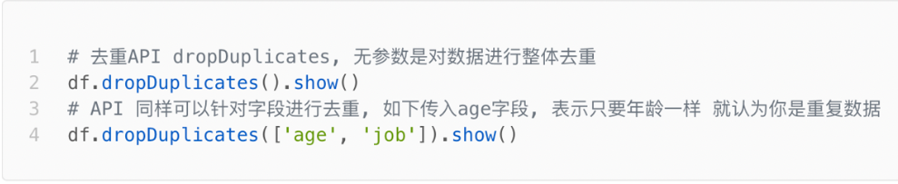
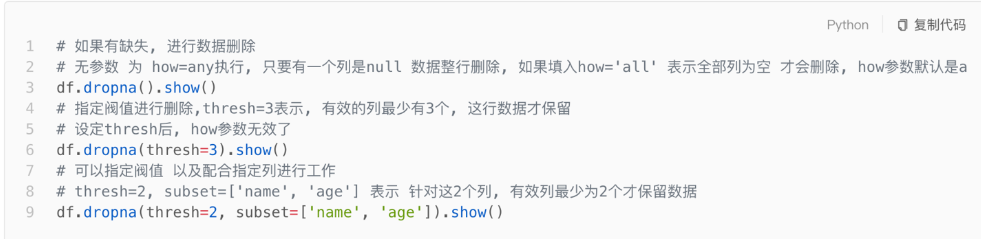
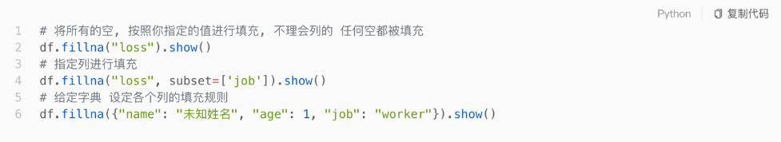

# Spark SQL的相关的清洗API

## 去重API:  df.dropDuplicates()

​	说明: 当不加参数的时候, 默认对数据整体进行去重,  同样支持针对指定列进行去重操作



## 删除null值数据:  df.dropna()

​	说明: 默认支持对所有列进行判断, 如果有一列的对应值为null, 就会将为null这一行数据全部都删除, 也支持针对某些列处理



## 替换null值:  df.fillna()

​	说明: 将表中为null的数据替换为指定的值. 同样也可以针对某些列来处理



## 代码演示

```python
from pyspark import SparkContext, SparkConf
from pyspark.sql import SparkSession
import os

# 锁定远端python版本:
os.environ['SPARK_HOME'] = '/export/server/spark'
os.environ['PYSPARK_PYTHON'] = '/root/anaconda3/bin/python3'
os.environ['PYSPARK_DRIVER_PYTHON'] = '/root/anaconda3/bin/python3'

if __name__ == '__main__':
    print("演示清洗相关的API")

    # 1- 创建SparkSession对象:
    spark = SparkSession.builder.master('local[*]').appName('movie').config("spark.sql.shuffle.partitions", "4").getOrCreate()

    # 2- 读取HDFS上movie数据集
    df_init = spark.read.csv(
        path='file:///export/data/workspace/sz30_pyspark_parent/_03_pyspark_sql/data/stu.csv',
        sep=',',
        header=True,
        inferSchema=True
    )
    # 演示一:  去重API:  df.dropDuplicates()
    df = df_init.dropDuplicates()

    df = df_init.dropDuplicates(['address','name'])

    # 演示二: 2-  删除null值数据:  df.dropna()
    df = df_init.dropna()

    df = df_init.dropna(thresh=3)

    df = df_init.dropna(thresh=2,subset=['name','address','age'])

    # 演示三:  替换null值:  df.fillna()
    df = df_init.fillna('aaaa')

    df = df_init.fillna('aaa',subset=['name','address'])
    df = df.fillna(1,subset=['id','age'])

    df = df_init.fillna({'id':0,'name':'未知','age':0,'address':'未知'})


    df_init.show()
    df.printSchema()
    df.show()
```

