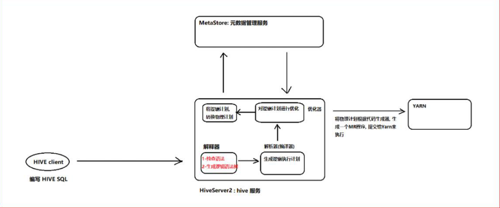

# Spark On Hive

## Hive SQL的执行流程



## 集成原理

说明:

```properties
HIVE的HiveServer2 本质上作用: 接收SQL语句 将 SQL 翻译为  MR程序 , 需要使用到相关元数据的时候, 连接metastore来获取即可


Spark on HIVE的本质:    将HIVE的MR执行引擎替换为 Spark RDD


思考: 对于HIVE来说, 本质上将SQL翻译为 MR . 这个操作是由hiveServer2来负责的, 所以说Spark On HIve主要目的, 将HiveServer2替换掉, 将其更换为Spark所提供的SparkServer2

认为Spark on HIVE本质:  替换掉HIVE中HiveServer2 让Spark提供一个spark的HiveServer2, 对接metastore 从而完成将SQL翻译为Spark RDD

好处: 
	1- 对于Spark来说, 也不需要自己维护元数据, 可以利用hive的metastore来维护
	2- 集成HIVE后, 整个HIVE的执行效率也提高了

spark集成目的: 抢占HIVE的市场
	所以Spark后续会提供一个分布式执行引擎, 此引擎就是为了模拟hiveServer2, 一旦模拟后, 会让用户感觉跟操作原来HIVE基本上雷同的, 比如说; 端口号, 连接的方式, 配置的方式全部都一致

思考: HIVE不启动hiveserver2是否可以执行呢? 可以的 通过 ./hive  
	启动hiveserver2的目的: 为了可能让更多的外部客户端连接,比如说 datagrip
```

## 配置操作

大前提:  要保证之前hive的配置没有问题

```properties
建议:
	在on hive配置前, 尝试先单独启动hive 看看能不能启动成功, 并连接

启动hive的命令:
cd /export/server/hive/bin
启动metastore: 
	nohup ./hive --service metastore &
启动hiveserver2:
	nohup ./hive --service hiveserver2 &
	
基于beeline连接: 
	./beeline 进入客户端
	输入: !connect jdbc:hive2://node1:10000
	输入用户名: root
	输入密码: 密码可以不用输入

注意:
	启动hive的时候, 要保证 hadoop肯定是启动良好了
	启动完成后, 如果能正常连接, 那么就可以退出客户端, 然后将HIVE直接通过 kill -9 杀掉了	

```

配置操作:

```properties
1) 确保 hive的conf目录下的hive-site.xml中配置了metastore服务地址
	<property>
        <name>hive.metastore.uris</name>
        <value>thrift://node1:9083</value>
    </property>

2) 需要将hive的conf目录下的hive-site.xml 拷贝到 spark的 conf 目录下
	如果spark没有配置集群版本, 只需要拷贝node1即可 
	如果配置spark集群, 需要将文件拷贝每一个spark节点上

3) 启动 hive的metastore服务:  
	cd /export/server/hive/bin
	nohup ./hive --service metastore &
	
	启动后, 一定要看到有runjar的出现
	
4) 启动 hadoop集群, 以及spark集群(如果采用local模式, 此集群不需要启动)

5) 使用spark的bin目录下: spark-sql 脚本 或者 pyspark 脚本打开一个客户端, 进行测试即可


测试小技巧:
	同时也可以将hive的hiveserver2服务启动后, 然后通过hive的beeline连接hive, 然后通过hive创建一个库, 在 spark-sql 脚本 或者 pyspark 脚本 通过 show databases 查看, 如果能看到, 说明集成成功了...


测试完成后, 可以将hive的hiveserver2 直接杀掉即可, 因为后续不需要这个服务:

首先查看hiveserver2服务的进程id是多少: 
	ps -ef | grep hiveserver2  或者 jps -m
	查看后,直接通过 kill -9  杀死对应服务即可

```

## 如何在代码中集成HIVE

```properties
import pandas as pd
from pyspark import SparkContext, SparkConf
from pyspark.sql import SparkSession
from pyspark.sql.types import *
import pyspark.sql.functions as F
import os

# 锁定远端python版本:
os.environ['SPARK_HOME'] = '/export/server/spark'
os.environ['PYSPARK_PYTHON'] = '/root/anaconda3/bin/python3'
os.environ['PYSPARK_DRIVER_PYTHON'] = '/root/anaconda3/bin/python3'

if __name__ == '__main__':
    print("演示 spark on hive的集成, 代码连接")
    # 1- 创建SparkSession对象
    spark = SparkSession\
        .builder\
        .master('local[*]')\
        .appName('udf_01')\
        .config('spark.sql.shuffle.partitions','4')\
        .config("spark.sql.warehouse.dir",'hdfs://node1:8020/user/hive/warehouse')\
        .config("hive.metastore.uris","thrift://node1:9083")\
        .enableHiveSupport()\
        .getOrCreate()
    # spark.sql.warehouse.dir : 指定 默认加载数据的路径地址,  在spark中, 如果不设置, 默认为本地路径
    # hive.metastore.uris : 指定 metastore的服务地址
    # enableHiveSupport() : 开启 和 hive的集成
    
    # 2- 构建数据集 
    spark.sql("show databases").show()
```

