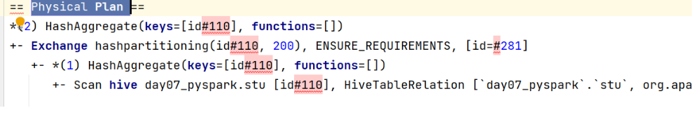

# Spark SQL的运行机制

## 回顾: Spark RDD中 Driver的运行机制

```properties
1- 当Driver启动后, 首先会先创建SparkContext对象, 此对象创建完成后, 在其底层同时创建: DAGSchedule 和 TaskScheduler

2- 当遇到一个action算子后, 就会启动一个JOB任务, 首先DAGSchedule将所有action依赖的RDD算子全部合并在一个stage中, 然后从后往前进行回溯, 遇到RDD之间有宽依赖(shuffle),就会拆分为一个新的stage阶段, 通过这种方式形成最终的一个DAG执行流程图, 并且划分好stage, 根据每个阶段内部的分区的数量, 形成每个阶段需要运行多少个线程(Task), 将每个阶段的Task线程放置到一个TaskSet列表中, 最后将各个阶段的TaskSet列表发送给 TaskSchedule

3- TaskSchedule接收到DAGschedule传递过来TaskSet, 依次的运行每一个stage, 将其各个线程分配给各个executor来进行运行执行

4- 后续不断监控各个线程执行状态, 直到整个任务执行完成
```

​	Spark SQL 底层依然需要将SQL语句翻译为Spark RDD操作 所以, Spark SQL也是存在上述的流程的, 只不过在上述流程中加入了 从spark SQL 翻译为Spark RDD的过程


内部详细流程:  大白话梳理

```properties
1- 当客户端将SQL提交到Spark中, 首先会将Sql提交给catalyst优化器

2- 优化器首先会先解析SQL, 根据SQL的执行顺序形成一个逻辑语法树(AST)

3- 接着对这个逻辑语法树 加入相关的元数据(连接metastore服务), 标识出需要从那里读取数据, 数据的存储格式, 用到那些表, 表的字段类型 等等..., 形成一个未优化的逻辑计划

4- catalyst开始执行RBO(规则优化)工作 :  将未优化的逻辑计划根据spark提供的优化方案对计划进行优化操作,比如说可以执行谓词下推, 列值裁剪, 提前聚合....  优化后得到一个优化后的逻辑执行计划

5- 开始执行 CBO(成本优化)工作:  在进行优化的时候, 由于优化的规则比较多, 可能匹配出多种优化方案, 最终可能会产生多个优化后的逻辑执行计划,导致形成多个物理执行计划,  此时通过代价函数(选最优), 选择出一个效率最高的物理执行计划

6- 将物理计划, 通过代码生成器工具 将其转换为 RDD程序

7- 将RDD提交到集群中运行, 后续的运行流程 跟之前RDD运行流程就完全一致了
```

专业术语:

```properties
1- sparkSQL底层解析是有RBO 和 CBO优化完成的
2- RBO是基于规则优化, 对于SQL或DSL的语句通过执行引擎得到未执行逻辑计划, 在根据元数据得到逻辑计划, 之后加入列值裁剪或谓词下推等优化手段形成优化的逻辑计划
3- CBO是基于优化的逻辑计划得到多个物理执行计划, 根据代价函数选择出最优的物理执行计划
4- 通过codegenaration代码生成器完成RDD的代码构建
5- 底层依赖于DAGScheduler 和TaskScheduler 完成任务计算执行
```

如何查看物理执行计划呢?

- 方式一: 通过spark thrift server的服务界面: 大概率是 4040界面


- 方式二:  通过SQL的命令

```properties
explain SQL语句
```



