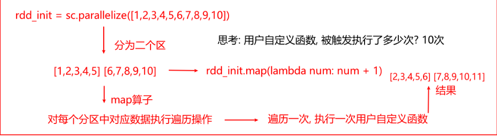
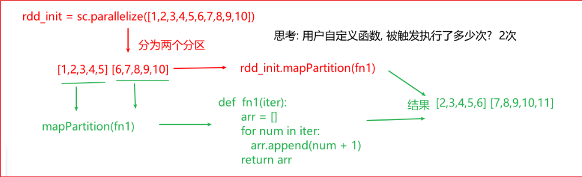

# RDD算子

## 分类

transformation(转换算子)

action(执行算子)

## 描述

transformation:

1-返回一个新的RDD

2-所有转换算子都是惰性的，只有通过action算子才会执行

3-RDD并不存储真实的数据，只存储转换的规则，当遇到action算子后，根据规则对数据进行处理即可

action:

1-不会返回RDD，要不然没有返回值，要不然返回其他的

2-所有action算子都是立即执行，每一个action都会去触发一个JOB任务

## RDD的Transformer算子操作

### 单值类型的算子

​	主要是针对value进行处理相关的算子（与key无关）

- map算子：一对一的转换操作
  - 作用：根据用户传入的自定义转换规则（函数）将数据一对一的转换成为一个新的RDD
  - map算子是作用在每一个分区的每一个元素上，对每一个元素执行自定义的函数

```properties
案例演示：
	rdd_init = sc.parallelize([1,2,3,4,5,6,7,8,9,10])
	#需求：对元素中每一个数据进行 +1 返回

	rdd_init.map(lambda num: num + 1).collect()
	结果为：
		[2, 3, 4, 5, 6, 7, 8, 9, 10, 11]
	说明：
		上述的自定义的匿名函数（lambda表达式），也可以自定义一个函数，然后调用
			#def map_fn(num) -> int:
				#return num + 1
			#rdd_init.map(map_fn).collect()
```

- groupBy算子：用于执行分组操作
  - 格式：groupBy(fn)
  - 作用：根据传入的函数对数据进行分组操作，每一组都是一个迭代器（列表）

```properties
案例演示：
	rdd_init = sc.parallelize([1,2,3,4,5,6,7,8,9,10])
    #需求：将数据分为偶数和奇数两部分
    rdd_init.groupBy(lambda num : 'o' if(num%2 == 0)  else 'j').mapValues(list).collect()
    说明：
    	mapValues(list):对kv类型进行处理，主要对其kv中value数据进行转换操作，参数可以写一个列表对象即可，表示直接将其转换为list列表
```

- filter算子：
  - 格式filter(fn)
  - 作用：根据传入自定义函数对数据进行过滤操作，自定义函数用于定义过滤的规则
  - 注意：返回过滤条件为true的值

```properties
案例需求：
	rdd_init = sc.parallelize([1,2,3,4,5,6,7,8,9,10])
	#需求：将>5的数据返回来
	rdd_init.filter(lambda num : num>5).collect()
	结果：
		[6,7,8,9,10]
	说明：
		指定保留值为true的过滤规则
```

- flatMap算子：
  - 格式：flatMap(fn)
  - 作用：先对数据传入的函数进行map操作，然后对map的结果进行扁平化

```properties
案例演示：
	rdd_init = sc.parallelize(['张三 李四 王五','赵六 吴七 周八'])
	#需求：将每一个名字提取出来，形成一个列表：结果['张三','李四','王五','赵六','吴七','周八']
	rdd_init.flatMap(lambda name : name.split()).collect()
	结果：
		['张三','李四','王五','赵六','吴七','周八']
```

### 双值类型的相关算子

- union和intersection:
  - union:并集，用于计算两个RDD的并集
  - intersection:交集，用于计算两个RDD的并集

```properties
案例演示：
	rdd1 = sc.parallelize([1,2,3,9,10])
	rdd2 = sc.parallelize([1,4,5,6,7,10])
	计算交集：
		rdd1.intersection(rdd2).collect() 结果：[1,10]
	计算并集：
		rdd1.union(rdd2).collect() 结果：[1,2,3,9,10,1,4,5,6,7,10]
		去重：
		rdd1.union(rdd2).distinct().collect() 结果：[4,1,9,5,2,10,6,3,7]
		
```

### kv类型的相关的算子

- groupByKey算子：
  - 格式：groupByKey()
  - 作用：根据key进行分组，将value合并为一个迭代器（列表）

```properties
案例：
	rdd_init = sc.parallelize([('c01','张三'),('c02','李四'),('c01','王五'),('c03','赵六'),('c02','田七'),('c01','周八')])
	#需求：根据key分组，将同一个班级的数据进行聚合在一起
 	rdd_init.groupByKey().collect()
	#返回两个迭代器对象
	[('c01', <pyspark.resultiterable.ResultIterable object at 0x7f2071ce8100>), ('c02', 	<pyspark.resultiterable.ResultIterable object at 0x7f2071ce8850>), ('c03', 			<pyspark.resultiterable.ResultIterable object at 0x7f2071ce88e0>)]
	#加mapValues(list)返回values列表
	rdd_init.groupByKey().mapValues(list).collect()
	结果：
		[('c01', ['张三', '王五', '周八']), ('c02', ['李四', '田七']), ('c03', ['赵六']
```

- reduceByKey算子：
  - 格式：reduceByKey(fn)
  - 作用：根据Key进行分组，将value合并为一个迭代器（列表），然后根据传入的自定义函数，对每组中value数据进行聚合处理

```properties
案例：
	rdd_init = sc.parallelize([('c01','张三'),('c02','李四'),('c01','王五'),('c03','赵六'),('c02','田七'),('c01','周八')])
	#需求：根据Key分组，将同一个班级的数据进行聚合在一起，统计每组中有多少个
	#map会取出每个元素进行操作，所以这里tmp参数就代表文件中列表内的每一个元组，tmp[0]就拿到了元组内的第一个元素
	rdd_map = rdd_init.map(lambda tmp: (tmp[0],1))
	rdd_map.reduceByKey(lambda agg,curr: agg + curr).collect()
	结果:[('c01', 3), ('c02', 2), ('c03', 1)]
```

- sortByKey算子：
  - 格式：sortByKey()
  - 作用：根据Key进行排序操作，默认为升序，如果要倒序排列，需要设置asc参数为False

```properties
案例：
	rdd_init = sc.parallelize([(100,'pv'),(300,'pv'),(200,'pv'),(500,'pv'),(800,'pv')])
	#需求：根据key进行倒序排序
	rdd_init.sortByKey().collect()
	结果： [(100, 'pv'), (200, 'pv'), (300, 'pv'), (500, 'pv'), (800, 'pv')] 
	
	rdd_init.sortByKey(False).collect()
	结果: [(800, 'pv'), (500, 'pv'), (300, 'pv'), (200, 'pv'), (100, 'pv')]
```

- countByValue算子：
  - 格式：countByValue()
  - 作用：根据kv中value进行count数量统计

```properties
案例：
	rdd_init = sc.parallelize([1,2,3,1,3,2,1,3,2,1,9,10])
	#需求：
	rdd_init.countByValue()
	结果为：
		{1: 4, 2: 3, 3: 3, 9: 1, 10: 1}
```

## RDD的action算子

- collect()
  - 格式：collect()
  - 作用：将各个分区的处理完成的数据收集回来，统一放置在一个列表中
- reduce()
  - 格式：reduce(fn)	
  - 作用：对数据进行聚合操作，根据传入的fn完成相关聚合统计

```properties
案例：
	rdd_init = sc.parallelize([1,2,3,1,3,2,1,3,2,1,9,10])
	#需求：将整个结果进行求和计算
	rdd_init.reduce(lambda agg,curr : agg + curr) 结果：38
```

- first
  - 格式：first()
  - 作用：获取第一个数据

```properties
案例：
	rdd_init = sc.parallelize([1,2,3,1,3,2,1,3,2,1,9,10])
	rdd_init.first()
```

- take
  - 格式：take(N)
  - 作用：获取前N个数据，类似SQL中的limit

```properties
案例：
	rdd_init = sc.parallelize([1,2,3,1,3,2,1,3,2,1,9,10])
	rdd_init.take(5)
```

- top
  - 格式：top(N,[fn])
  - 作用：首先对数据进行降序排序，排序后，获取前N个元素，同时支持自定义排序规则	
    - 对于单值类型的数据，直接降序排序，对于kv类型的，默认按照k进行倒序排序，也可以进行自定义排序方案

```properties
案例：
	rdd_init = sc.parallelize([1,2,3,1,3,2,1,3,2,1,9,10])
	rdd_init.top(5)
```

- count
  - 格式：count()
  - 作用：获取一共返回多少个元素

```properties
案例：
	rdd_init = sc.parallelize([1,2,3,1,3,2,1,3,2,1,9,10])
	rdd_init.count()
```

- takeSample
  - 格式：takeSample(是否允许重复抽取，抽样数量，种子值)
  - 作用：用于对数据进行抽样
  - 说明：一旦设置种子值，会导致每次采样的结果都是一致的

```properties
案例：
	rdd_init = sc.parallelize([1,2,3,1,3,2,1,3,2,1,9,10])
	#进行抽样
	>>> rdd_init.takeSample(False,5,1)
    [7, 9, 10, 8, 6]
    >>> rdd_init.takeSample(False,5,1)
    [7, 9, 10, 8, 6]
    >>> rdd_init.takeSample(False,5)  
    [8, 3, 6, 5, 2]
    >>> rdd_init.takeSample(False,5)
    [1, 4, 7, 10, 2]
    >>> rdd_init.takeSample(True,5)
	[9, 1, 1, 1, 6]
```

- foreach
  - 格式：foreach(fn)
  - 作用：对数据执行遍历操作，fn表示每次遍历要执行什么操作，没有返回值

```properties
案例：
	rdd_init = sc.parallelize([1,2,3,1,3,2,1,3,2,1,9,10])
	#对数据进行遍历打印
	rdd_init.foreach(lambda num : print(num))
```

## RDD的重要算子

### 分类

基本函数、分区函数、重分区函数、调整分区函数、聚合函数、关联函数

### 基本函数

### 分区操作函数

```properties
	分区函数:指的是对rdd中每一个分区进行处理操作
	普通函数:指的是对RDD中每一个分区下每一个元素进行操作
	如: map和maPatitions,foreach 和foreachPartition
	下面的两个图描述了分区函数和普通函数区别，一个对每个分区中每个元素执行自定义函数，而分区函数是直接将整个分区数据传递给了自定义函数，从而导致分区函数触发执行自定义函数次数更低一些，普通函数自定义函数触发次数更多
	分区函数的好处：
		减少自定义函数触发的次数，如果说自定义函数中有一些资源相关的操作（比如IO），触发次数减少了 资源调度少了
	举例说明：
		比如说，需要将每一个数据依次的写入到数据库中，此时可以通过foreach相关函数来处理，遍历一个，然后将数据在自定义函数在自定义函数开启连接数据库连接，将数据写入到数据库中，有多少个元素，就需要开启多少次连接
		但是如果使用foreachPartition,可能只需要开启两次就能解决问题
		
	以后工作中，使用相关算子的时候，如果有分区函数，建议优先使用分区函数
```

Map算子：



mapPartitions算子:



map和mapPartitions

```properties
案例演示：
	rdd_init = sc.parallelize([1,2,3,1,3,2,1,3,2,1,9,10])
	#需求：对元素中每一个数值进行 +1 返回
	#map算子
	rdd_init.map(lambda num:num + 1).collect()
	#mapPartitions
def fn1(iter):
    for num in iter:
        yield num + 1
    rdd_init.mapPartitions(fn1).collect()
```

foreach和foreachPartition

```properties
案例：
	rdd_init = sc.parallelize([1,2,3,1,3,2,1,3,2,1,9,10])
	#对数据进行遍历打印
	rdd_init.foreach(lambda num:print(num))
	#foreachPartition
	def fn1(iter)
		for num in iter
			print(num)
		rdd_init.foreachPartition(fn1)
```

### 重分区函数

```properties
作用：对RDD中分区数量进行增大或者减少
在什么时候需要增大分区数量？
	一个分区最终是通过一个线程来处理，当分区中数据量比较大的时候，也就意味着每个线程处理的数据量比较大，此时可以增大分区数量，从而减少每个线程处理的数据量，提高并行度，提升效率
在什么时候需要减少分区数量？
	当每个分区中数据量比较少的时候，过多的分区增加了资源损耗。此时可以减少分区的数量，减少资源的浪费
	当需要将数据写出到文件系统的时候，分区越多意味着输出的文件数量越多，减少分区数量从而减少输出文件数量，避免小文件过多
```

repartition算子

```properties
作用：增加或者减少分区的数量，此算子会产生shuffle
格式：repartition(N)
演示：
	rdd_init = sc.parallelize([1,2,3,4,5,6,7,8,9,10],3)
	rdd_init.glom().collect()
	各分区的数据: [[1, 2, 3], [4, 5, 6], [7, 8, 9, 10]]
	# 将分区变更为 5个
	rdd = rdd_init.repartition(5)
	rdd.getNumPartitions()
	# 5
	rdd.glom().collect()
	# [[], [1, 2, 3], [7, 8, 9, 10], [4, 5, 6], []]
	
```

coalesce算子：

```properties
作用：减少分区，而且不会产生shuffle
格式：coalesce(N,ifshuffle=false)参数2表示是否有shuffle，默认为False,表示没有 此时只能减少分区，如果需要增大分区，需要设置为True
案例：
	rdd_init = sc.parallelize([1,2,3,4,5,6,7,8,9,10],3)
	#首先看每一个分区的数据
	rdd_init.glom().collect()
	结果： [[1, 2, 3], [4, 5, 6], [7, 8, 9, 10]]
	#将三个分区，合并为两个分区
	rdd_init.coalesce(2).glom().collect()
	结果： [[1, 2, 3], [4, 5, 6, 7, 8, 9, 10]]
	rdd_init.coalesce(5,True).glom().collect()
	结果： [[], [1, 2, 3], [7, 8, 9, 10], [4, 5, 6], []]  参数2设置为True即可增加分区了
```

总结说明：

```properties
repartition是coalesce的一种当参数2为True一种简写
coalesce默认只能进行减少分区，如果要增大分区，需要将参数2设置为True,一旦设置为True就会产生shuffle
区别：
	1-两个算子都是用于重分区的算子，一个能增大也能减少，而coalesce默认只能减少分区
	2-repartition默认会产生shuffle。而coalesce默认没有shuffle
	3-repatition是coalesce的一种当参数2为True一种简写
```

### 调整分区函数

专门针对kv类型数据调整分区的函数：partitionBy

```properties
格式：
	partitionBy(N,[fn])参数2是用于设置分区规则
演示：
	rdd_init = sc.parallelize([1,2,3,4,5,6,7,8,9,10],3)
	rdd_map = rdd_init.map(lambda num: (num,1))
	#查看每个分区的数据
	rdd_map.glom().collect()
	结果：[
			[(1, 1), (2, 1), (3, 1)], 
			[(4, 1), (5, 1), (6, 1)], 
			[(7, 1), (8, 1), (9, 1), (10, 1)]
		]
	
	#进行重分区操作：
	rdd_map.partitionBy(2).glom().collect()
	结果： [[(2, 1), (4, 1), (6, 1), (8, 1), (10, 1)], [(1, 1), (3, 1), (5, 1), (7, 1), (9, 1)]]
	
	说明：默认根据Key的hash值进行分区操作
	rdd_map.partitionBy(2,lambda num : 0 if(num>5) else 1).glom().collect()
	结果：[
			[(6, 1), (7, 1), (8, 1), (9, 1), (10, 1)],
            [(1, 1), (2, 1), (3, 1), (4, 1), (5, 1)]
         ]
	
	
```

### 聚合函数

```properties
第一类:单值聚合算子
	reduce | fold | aggregate
格式：
	reduce(fn):根据传入的自定义函数，对整个数据集进行聚合统计
	fold(default,fn):根据传入的自定义函数，对整个数据集进行聚合统计,并且可以设置agg的初始值
	aggregate(default,fn1,fn2):参数1表示agg初始值，参数2：对每个分区执行函数 参数3：对每个分区及结果进行聚合函数
演示：
	rdd_init = sc.parallelize([1,2,3,4,5,6,7,8,9,10])
	
	#需求：对所有的数据进行求和计算
	#reduce
	rdd_init.reduce(lambda agg,curr: agg+curr) 结果55
	#fold
	rdd_init.fold(10,lambda agg,curr:agg+curr) 结果85
	#aggregate(default,fn1,fn2)
	def fn1(agg,curr):
		return agg+curr
	def fn2(agg,curr):
		return agg+curr	
	rdd_init.aggregate(10,fn1,fn2) 结果85
```

```properties
第二类：kv类型聚合算子
相关算子：groupByKey() reduceByKey() foldByKey() aggregateByKey()

说明：
	reduceByKey() foldByKey() aggregateByKey()和reduce | fold | aggregate都是类型的时候，只是比单值多了一个分组操作，对每一个组内部聚合
	
	groupByKey() 是仅分组 无聚合计算
```

### 关联函数

```properties
涉及到函数格式: 
	join()  : 内连接
	leftOuterJoin() :  左关联
	rightOuterJoin(): 右关联
	fullOuterJoin() : 全外关联

针对数据类型: kv

案例:
	rdd1 = sc.parallelize([('c01','大数据一班'),('c02','大数据二班'),('c03','大数据三班')])
	rdd2 = sc.parallelize([('c01','张三'),('c02','李四'),('c01','王五'),('c04','赵六'),('c02','田七'),('c01','周八')])
	
	# Join
	rdd1.join(rdd2).collect()
	结果: [
			('c01', ('大数据一班', '张三')), 
			('c01', ('大数据一班', '王五')), 
			('c01', ('大数据一班', '周八')), 
			('c02', ('大数据二班', '李四')), 
			('c02', ('大数据二班', '田七'))
		  ]
	# leftJoin
	rdd1.leftOuterJoin(rdd2).collect()
	结果: 
		[
			('c01', ('大数据一班', '张三')), 
			('c01', ('大数据一班', '王五')), 
			('c01', ('大数据一班', '周八')), 
			('c02', ('大数据二班', '李四')), 
			('c02', ('大数据二班', '田七')), 
			('c03', ('大数据三班', None))
		]
	# rightJoin
	rdd1.rightOuterJoin(rdd2).collect()
	结果:
		[
			('c04', (None, '赵六')), 
			('c01', ('大数据一班', '张三')), 
			('c01', ('大数据一班', '王五')), 
			('c01', ('大数据一班', '周八')), 
			('c02', ('大数据二班', '李四')), 
			('c02', ('大数据二班', '田七'))
		]
	# fullJoin
	rdd1.fullOuterJoin(rdd2).collect()
	结果:
		[
			('c04', (None, '赵六')), 
			('c01', ('大数据一班', '张三')), 
			('c01', ('大数据一班', '王五')), 
			('c01', ('大数据一班', '周八')), 
			('c02', ('大数据二班', '李四')), 
			('c02', ('大数据二班', '田七')), 
			('c03', ('大数据三班', None))
		]
```

