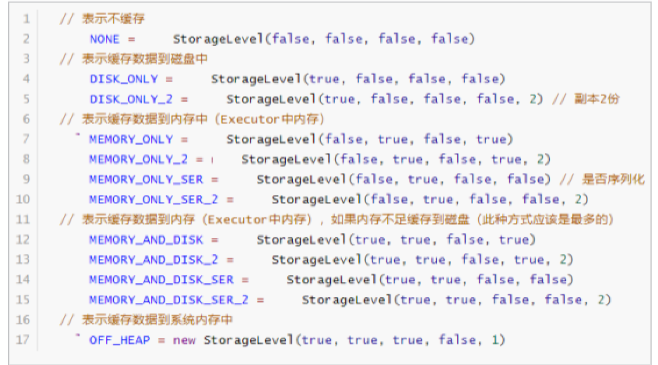

# RDD的持久化

## RDD的缓存

```properties
缓存：
	当一个RDD的产生过程（计算过程），是比较昂贵的（生成RDD整个计数流程比较复杂），并且这个RDD可能会被重复使用。此时为了提升计算效率，可以将RDD的结果设置为缓存，这样后续在使用这个RDD时，无需重新计算，直接获取缓存中的数据即可。
	提升Spark的容错能力，正常情况下，当Spark中某一个RDD计算失败的时候，需要对整个RDD链条进行整体的回溯计算，有了缓存后，可以将某些阶段的RDD进行缓存操作，这样当后续的RDD计算失败的时候，可以从最近的一个缓存中恢复数据，重新计算即可，无需再回溯所有链条
应用场景：
	1-当一个RDD被重复使用的时候，可以用缓存来解决
	2-当一个RDD产生非常昂贵的时候，可以将RDD设置为缓存
	3-当需要提升容错能力的时候，可以在局部设置一些缓存来提升容错能力
注意事项：
	1-缓存仅仅是一种临时缓存，可以将RDD的结果数据存储到内存（executor）或者磁盘，甚至可以存储到堆外内存（executor以外的系统内存）中
	2-由于缓存的存储是一种临时存储，所以缓存的数据有可能丢失，所以缓存操作并不会将RDD之间的依赖关系给截断掉（清除掉），以防止当缓存数据丢失的时候，可以让程序进行重新计算操作。
	3-缓存的API都是lazy的，设置缓存后，并不会立即触发，如果需要立即触发，后续必须跟一个action算子，建议使用count
```

如何使用缓存

```properties
设置缓存的相关API：
	rdd.cache():执行设置缓存的操作，cache在设置缓存的时候，仅能将缓存数据放置到内存中
	rdd.persist(设置缓存级别):执行设置缓存的操作，默认情况下，将缓存数据放置到内存中，同时支持设置其他缓存方案
手动清理缓存：
	rdd.unpersist():清理缓存
默认情况下，当程序执行完成后，缓存会被自动清理

常用的缓存级别有哪些呢？
	MEMORY_ONLY:仅缓存到内存中，直接讲整个对象保存到内存中
	MEMORY_ONLY_SER:仅缓存到内存中，同时在缓存数据的时候，会对数据进行序列化（从对象-->二进制数据）操作，可以在一定程度上减少内存的使用量
	MEMORY_AND_DISK
	MEMORY_AND_DISK_2:优先讲数据保存到内存中，当内存不足的时候，可以将数据保存到磁盘中，带2的表示保存两份
	
	MEMORY_AND_DISK
	MEMORY_AND_DISK:优先讲数据保存到内存中，当内存不足的时候，可以将数据保存到磁盘中，带2的表示保存两份。对于保存到内存的数据，会进行序列化的操作，从而减少内存占用量，提升内存保存数据体量，对磁盘必须要进行序列化
	OFF_HEAP 表示缓存数据到系统内存
	序列化:将数据从对象转换为二进制的数据，对于RDD的数据来说，内部数据都是一个个对象，如果没有序列化是直接将对象存储到内存中，如果有序列化会将对象转换为二进制然后存储到内存中
	好处:减少内存的占用量，从而让优先内存可以存储更多的数据
	弊端:会增大对CPU的占用量，因为转换的操作。需要使用CPU来操作
	
	带2表示的保存多个副本，从而提升数据可靠性
	一般建议，设置完缓存后，让其立即触发（使用action算子，一般是用count()）
```




代码执行：

```python
# 搜狗案例
from pyspark import SparkContext, SparkConf,StorageLevel
import os
import jieba
import time

# 锁定远端python版本:
os.environ['SPARK_HOME'] = '/export/server/spark'
os.environ['PYSPARK_PYTHON'] = '/root/anaconda3/bin/python3'
os.environ['PYSPARK_DRIVER_PYTHON'] = '/root/anaconda3/bin/python3'

def xuqiu_1():
    # 5.1.1 获取搜索词
    rdd_search = rdd_map.map(lambda line_tup: line_tup[2])
    # 5.1.2 对搜索词进行分词操作
    rdd_keywords = rdd_search.flatMap(lambda search: jieba.cut(search))
    # 5.1.3 将每个关键词转换为  (关键词,1) 进行分组统计
    rdd_res = rdd_keywords.map(lambda keyword: (keyword, 1)).reduceByKey(lambda agg, curr: agg + curr)
    # 5.1.4: 对结果数据进行排序(倒序)
    rdd_sort = rdd_res.sortBy(lambda res: res[1], ascending=False)
    # 5.1.5 获取结果(前50)
    print(rdd_sort.take(50))


def xuqiu_2():
    # SQL: select  user,搜索词 ,count(1) from  表 group by user,搜索词;
    # 提取 用户和搜索词数据
    rdd_user_search = rdd_map.map(lambda line_tup: (line_tup[1], line_tup[2]))
    # 基于用户和搜索词进行分组统计即可
    rdd_res = rdd_user_search.map(lambda user_search: (user_search, 1)).reduceByKey(lambda agg, curr: agg + curr)
    rdd_sort = rdd_res.sortBy(lambda res: res[1], ascending=False)
    print(rdd_sort.take(30))
if __name__ == '__main__':
    print("搜狗案例")
    # 1- 创建SparkContext对象
    conf = SparkConf().setMaster('local[*]').setAppName('sougou')
    sc = SparkContext(conf=conf)

    # 2- 读取外部文件数据
    rdd_init = sc.textFile('file:///export/data/workspace/sz30_pyspark_parent/_02_pyspark_core/data/SogouQ.sample')

    # 3- 过滤数据: 保证数据不能为空 并且数据字段数量必须为 6个
    rdd_filter = rdd_init.filter(lambda line: line.strip() != '' and len(line.split()) == 6)

    # 4- 对数据进行切割, 将数据放置到一个元组中: 一行放置一个元组
    rdd_map = rdd_filter.map(lambda line: (
        line.split()[0],
        line.split()[1],
        line.split()[2][1:-1],
        line.split()[3],
        line.split()[4],
        line.split()[5]
    ))
    #-------------------设置缓存的代码-----------
    #注意：①设置缓存的类需要先Import导入
    	  #②设置完缓存设置action触发
    rdd_map.persist(storageLevel)=storageLevel.MEMORY_AND_DISK.count()
        
       
    # 5- 进行统计分析处理
    # 5.1 : 统计每个关键词出现了多少次
    # 快速抽取函数: ctrl + alt + m
    xuqiu_1()
    
    #-------------------手动清理缓存-----------
    rdd_map.unpersist().count()
    
     #5.2 需求二: 统计每个用户每个搜索词点击的次数
    xuqiu_2()

    time.sleep(1000)
```

判断缓存生效：DAG流程图中可以看到一个小绿球

## RDD的chechpoint检查点

```properties
	checkPoint跟缓存类似，也可以将某一个RDD结果进行存储操作，一般都是将数据缓存到HDFS中，提供一种更加可靠的存储方案，所以说采用chechPoint方案，会将RDD之间的依赖关系给截断掉（因为数据存储非常的可靠）
	checkPoint出现，从某种角度上也可以提升执行效率（没有缓存高），更多是为了提升容错能力（cache更多的是为了提升效率）
	对于checkPoint来说，可以理解为对整个RDD链条进行设置阶段快照的操作
	
	由于checkpoint这种可靠性，所以spark本身只管设置，不管删除，所以checkpoint即使程序停止了，checkpoint数据依然存储着，需要手动删除

如何设置checkpoint：
	1-通过sc对象，设置checkpoint保存数据的位置
	
	2-通过rdd.checkpoint()设置开启检查点（lazy）
	
	3-通过rdd.count()触发检查点的执行
```

代码演示：

```python
# 演示checkpoint
from pyspark import SparkContext, SparkConf
import os
import time

# 锁定远端python版本:
os.environ['SPARK_HOME'] = '/export/server/spark'
os.environ['PYSPARK_PYTHON'] = '/root/anaconda3/bin/python3'
os.environ['PYSPARK_DRIVER_PYTHON'] = '/root/anaconda3/bin/python3'

if __name__ == '__main__':
    print("演示checkpoint")

    # 1- 创建SparkContext对象
    conf = SparkConf().setMaster('local[*]').setAppName('sougou')
    sc = SparkContext(conf=conf)
    
    #2-设置检查点位置
    sc.setCheckpointDir('/spark/checkpoint/')
	
    #2-读取数据
    rdd_init = sc.textFile('file:///export/data/workspace/sz30_pyspark_parent/_02_pyspark_core/data/SogouQ.sample')
    
    # 3- 一下演示代码, 无任何价值
    rdd_map1 = rdd_init.map(lambda line:line)
    rdd_map2 = rdd_map1.map(lambda line: line)
    rdd_3 = rdd_map2.repartition(3)
    rdd_map3 = rdd_3.map(lambda line: line)
    rdd_map4 = rdd_map3.map(lambda line: line)
    rdd_4 = rdd_map4.repartition(2)
    rdd_map5 = rdd_4.map(lambda line: line)
    
    #开启检查点
    rdd_map5.checkpoint()
    rdd_map5.count()
    
    print(rdd_map5.count())

    time.sleep(1000)
    
```

在Spark中RDD的缓存和检查点有什么区别呢？

```properties
1-存储的位置
	缓存:会将RDD的结果数据缓存到内存或者磁盘，或者堆外内存
	检查点:会将RDD的结果数据存储到HDFS（默认），当然也支持本地存储（仅在local模式，但如果是local模式，检查点无所谓）
2-依赖关系
	缓存:由于缓存的存储是一种临时存储，所以缓存不会被截断掉依赖关系，以防止缓存丢失后，进行回溯计算
	检查点:会截断掉依赖关系，因为检查点方案认为存储数据是可靠的，不会丢失
3-生命周期
	缓存:当整个程序执行完成后（一个程序中是包含多个JOB任务），会自动清理掉缓存数据，或者也可以在程序运行中手动清理
	检查点:会将数据保存到HDFS中，不会自动删除，即使程序停止了，检查点数据依然存在，只能手动删除数据（会永久保存）
```

​	注意：在实际使用中，在Spark程序中，会将两种方案都作用于程序中，先设置检查点，再设置缓存（缓存的执行不能在检查点前，否则缓存无意义）


