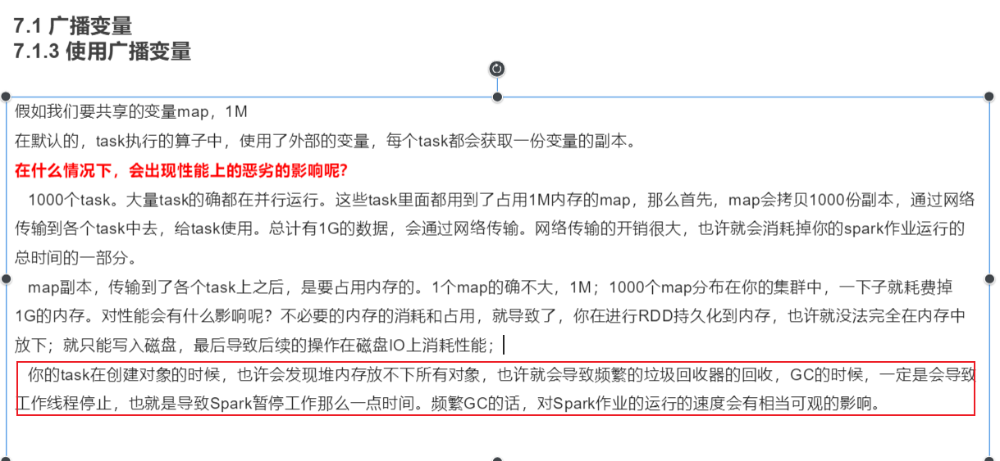
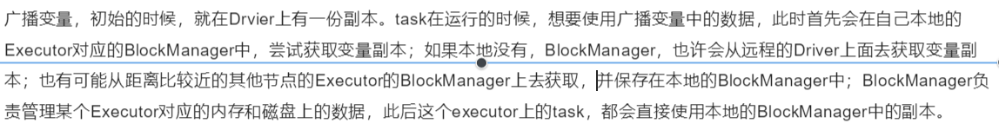

# RDD的共享变量

### 广播变量

```properties
广播变量
	目的:减少Driver和executor之间网络数据传输数据量，以及减少内存的使用，从而提升效率
	
	适用于:多个Task线程需要使用到同一个变量的值的时候（类似闭包，函数调用了外部参数）
	
	默认做法：
		各个线程会将这个变量形成一个副本，然后拷贝到自己的线程中，进行使用即可，由于一个executor中有多个线程，那么意味需要拷贝多次，导致executor和Driver的传输量增加，对带宽有一定影响，同时拷贝了多次，对内存占用量提升
	解决方案：引入一个广播变量
		让executor从Driver中拉去过来一个副本即可，一个executor只需要拉取一次副本，让executor中各个线程读取
		
	注意：广播变量是只读的，各个线程只读取数据，不能修改数据
如何使用广播变量：
	通过SC创建一个广播变量:在Driver设置
		广播变量对象 = sc.broadcast()
		
```



BlockManager



代码演示：

```python
from pyspark import SparkContext, SparkConf
import os
import time

# 锁定远端python版本:
os.environ['SPARK_HOME'] = '/export/server/spark'
os.environ['PYSPARK_PYTHON'] = '/root/anaconda3/bin/python3'
os.environ['PYSPARK_DRIVER_PYTHON'] = '/root/anaconda3/bin/python3'

if __name__ == '__main__':
    print("演示广播变量的使用操作")
    #1-创建SparkConftext对象
    conf = SparkConf().setMaster(local[*]).setAppName('sougou')
    sc = SparkContext(conf=conf)
    
    #设置广播变量
    bc = sc.broadcast(1000)
    
    #2-读取数据
    rdd_init = sc.parallelize([1,2,3,4,5,6,7,8,9,10])
    
    #3-将每个数据都加上指定值，此值由广播变量给出：
    #获取广播：bc.value
    rdd_res = rdd_init.map(lambda num: num + bc.value)
    
    #4-打印结果
    rdd_res.foreach(lambda num: print(num))
    time.sleep(10000)
```


### 累加器accumulator

```properties
	概述:累加器主要提供在多个线程中对一个变量进行累加的操作，对于多个线程来说只能对数据进行累加，不能读取数据，读取数据的工作只能有Driver来处理;累加器能保证在 Spark 任务出现问题被重启的时候不会出现重复计算
	应用场景:全局累加操作
	如何使用呢：
	1-有Driver来设置一个累加器的初始值
	累加器对象 = sc.accumulator(初识值)
	
	2-由RDD（线程）来进行累加操作
		累加器对象.add(添加内容)
		
	3-在Driver中获取值：
		累加.value()
	
```

spark内置了三种类型的accumulator,分别是LongAccumulator用来累加整数型，DoubleAccumulator用来累加浮点型，CollectionAccumulator用来累加集合元素。

代码实现：

```python
from pyspark import SparkContext, SparkConf
import os

# 锁定远端python版本:
os.environ['SPARK_HOME'] = '/export/server/spark'
os.environ['PYSPARK_PYTHON'] = '/root/anaconda3/bin/python3'
os.environ['PYSPARK_DRIVER_PYTHON'] = '/root/anaconda3/bin/python3'


if __name__ == '__main__':
    print("演示累加器")
    # 1- 创建SparkContext对象
    conf = SparkConf().setMaster(local[*]).setAppName('sougou')
    sc.SparkContext(conf=conf)
    
    #定义一个变量，引入累加器
    a = sc.accumulator(10)
    
    #2-读取数据
    rdd_init = sc.parallelize([1,2,3,4,5,6,7,8,9,10])
    
    #3-处理数据：为a将列表中变量的值累加上去
    def fn1(num):
        #对累加器进行增加
        a.add(num)
        return num
    rdd_map = rdd_init.map(fn1)
    print(rdd_map.collect())
    # 获取累加器的结果
    print(a.value)
```

有一个问题点：

```python
	当我们设置过累加器的RDD，后续在进行一些其它的操作，调度多次action算子后，发现累加器被累加了多次，本该只累加一次，这种情况是如何产生的呢？
	原因：当调度多次action的时候，会产生多个JOB（计算任务），由于RDD只存储计算的规则，不存储数据，当第一个action计算完成后，得到一个结果，整个任务完成了，接下来再运行下一个Job的任务，这个任务依然需要重头开始进行计算最终得到结果。累加的操作就会被触发多次
	解决方案：
		设置缓存或者检查点
```


​	

